# Centralized IAM Platform: A Reference Architecture for Multi-Product SaaS

> **Scope note:** This is a vendor-agnostic reference architecture I built to think through how I'd design a centralized identity platform for an organization that has grown through acquisition — where each product line historically ran its own authentication stack with no shared identity foundation. It draws on 15+ years of distributed-systems and identity/access-management work in regulated financial services, but **it is not based on any specific employer's actual systems, internal architecture, or confidential information.** Diagrams and any benchmark figures are illustrative, not measured production data — labeled as such throughout.

---

## Table of Contents

1. [Executive Summary](#1-executive-summary)
2. [Current State (As-Is): Fragmented Per-Product Identity](#2-current-state-as-is-fragmented-per-product-identity)
3. [Requirements Traceability](#3-requirements-traceability)
4. [Target Architecture: Centralized IAM Platform](#4-target-architecture-centralized-iam-platform)
   - [4a. Authentication Flow](#4a-authentication-flow--establishing-identity)
   - [4b. Authorization & Service Enforcement Flow](#4b-authorization--service-enforcement-flow--what-an-authenticated-identity-can-actually-do)
   - [4c. Alternative Enforcement Pattern: Nginx + Auth Proxy](#4c-alternative-enforcement-pattern-nginx--auth-proxy)
5. [Transitional / Intermediate Architecture](#5-transitional--intermediate-architecture)
   - [5a. User Migration Strategy](#5a-user-migration-strategy)
6. [Organization → Tenant Model](#6-organization--tenant-model)
7. [Identity Classes & RBAC Design](#7-identity-classes--rbac-design)
8. [SSO Design: Keycloak Clustering](#8-sso-design-keycloak-clustering)
9. [API Gateway + Keycloak as Identity Provider](#9-api-gateway--keycloak-as-identity-provider)
10. [Delegated Administration: GitOps + OPA](#10-delegated-administration-gitops--opa)
11. [MFA Approach](#11-mfa-approach)
12. [Protocol Selection Guidance: SAML vs. OAuth2/OIDC](#12-protocol-selection-guidance-saml-vs-oauth2oidc)
13. [Vendor-Agnostic Note: Open-Source vs. Proprietary IdP](#13-vendor-agnostic-note-open-source-vs-proprietary-idp)
14. [Machine Identity & Service-to-Service Security](#14-machine-identity--service-to-service-security)
15. Standards & References *(coming next)*
16. Extensions Considered *(coming next)*
17. About This Document *(coming next)*

---

## 1. Executive Summary

Organizations that grow through acquisition often end up with a product portfolio where each acquired product brought its own user store, its own login flow, and its own notion of "who is a user." The result: customers juggle multiple logins across a supposedly unified suite, engineering teams re-implement the same authentication logic per product, and no one can answer basic governance questions ("who has access to what, across the whole portfolio?") without a manual audit.

This document is a reference architecture for solving that problem: a **centralized Identity and Access Management (IAM) platform** that becomes the single authentication, authorization, and governance foundation across every product in the portfolio — while still supporting the full range of identity types a modern SaaS platform actually has to serve:

- **Customers** — end users of the products
- **Employees** — internal staff needing access to internal tooling and admin surfaces
- **Partners** — external organizations with delegated, scoped access to specific products or data
- **APIs** — first- and third-party API consumers
- **Machine identities** — services, jobs, and workloads authenticating to each other, not to a human

The architecture is deliberately **vendor-agnostic**: the concrete diagrams in this document use **Keycloak** as the open-source reference implementation, but the same design applies equally to a proprietary identity provider such as **Okta**, **Auth0**, **Ping Identity**, or **Microsoft Entra ID** — the IdP is a replaceable component behind a stable set of interfaces (OIDC/OAuth2/SAML), not the architecture itself.

**How to read this document:** Section 2 shows the fragmented starting point most acquisition-heavy portfolios share. Section 3 is a traceability table if you want to jump straight to a specific capability. Sections 4-5 lay out the target state and the transitional path to get there. Sections 6-14 go deep on each major capability (multi-tenancy, RBAC, SSO, API security, delegated admin, MFA, protocol choice, machine identity). Section 16 is deliberately explicit about what a production rollout would still need beyond what's diagrammed here.

## 2. Current State (As-Is): Fragmented Per-Product Identity

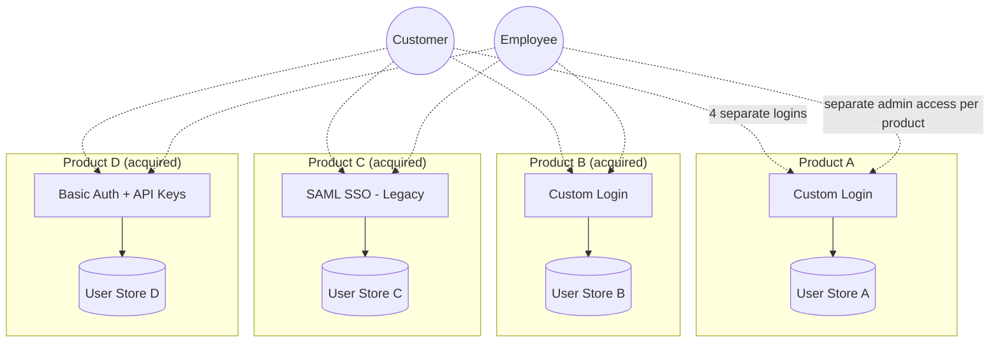

**Consequences of this state:**
- A customer using three products in the suite has three separate accounts, three passwords, three MFA enrollments.
- There is no single place to answer "does this partner still have access to anything?" — it requires checking every product individually.
- Every new product acquisition adds another bespoke auth integration instead of plugging into a shared foundation.
- Security incident response (e.g., "revoke this user's access everywhere, now") is a manual, per-product fire drill instead of one action.
- Compliance evidence (SOC 2, ISO 27001, access reviews) has to be assembled per product rather than generated once from a central system.
- Without a unified view of who holds what access across the whole portfolio, **toxic combinations of access rights** (e.g., a user who can both administer a product and approve changes to it in another — a segregation-of-duties violation) are effectively invisible until an audit or an incident surfaces them.

## 3. Requirements Traceability

A quick map from capability asked-for to where it's addressed in this document.

| Capability | Section |
|---|---|
| Centralized identity foundation across multiple products/business domains | §4, §5 |
| Authentication, authorization, identity governance | §4, §7, §10 |
| Serves customers, employees, partners, APIs, machine identities | §4, §6, §7 |
| Platform architecture & technical direction | §4, §5 |
| Drive adoption / migration across engineering teams | §5, §5a, §16 |
| RBAC, ABAC, delegated administration | §7, §10 |
| Multi-tenant environments | §6 |
| Governance & regulatory/compliance requirements | §16 |
| Architecture reviews / technical design discussions | Document itself, plus §3 traceability |
| OAuth 2.0, OIDC, SAML, JWTs, MFA, enterprise SSO | §8, §9, §11, §12 |
| Enterprise IAM platform integration (Keycloak, Okta, Auth0, Ping, Zitadel, Authentik) | §8, §13 |
| Secure, scalable services in cloud-based/SaaS environments | §4, §9, §14 |
| Policy engines (OPA / Cedar) | §10 |
| Machine identities, secrets management, workload authentication | §14 |
| Large-scale platform migrations / modernization | §5, §16 |
| SOC 2, ISO 27001, HIPAA, PCI-DSS, NIST | §16 |

## 4. Target Architecture: Centralized IAM Platform

Split into two diagrams on purpose: authentication (establishing who someone is) and authorization/enforcement (what they can do once they're in) are different concerns with different failure modes, and conflating them in one diagram made the picture harder to read than it needed to be.

### 4a. Authentication Flow — establishing identity

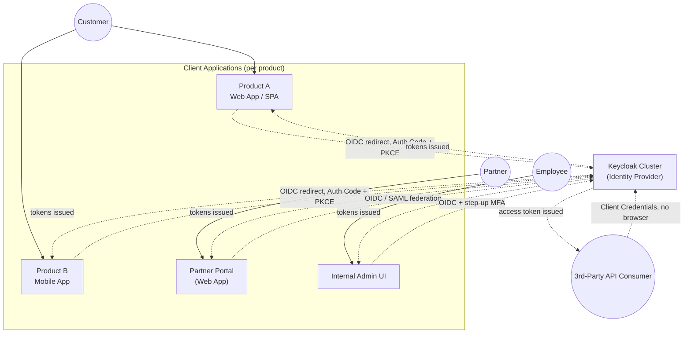

**Where the frontend sits, explicitly:** each product's client application (web SPA, mobile app, partner portal, internal admin UI) is itself an OIDC client. It never talks to the identity provider on the user's behalf silently — the user is redirected to the IdP to authenticate (Authorization Code + PKCE for browser/mobile clients, so the client never handles raw credentials), gets redirected back with an authorization code, and the client exchanges that for tokens. §9 and §12 walk through this exact sequence step by step.

### 4b. Authorization & Service Enforcement Flow — what an authenticated identity can actually do

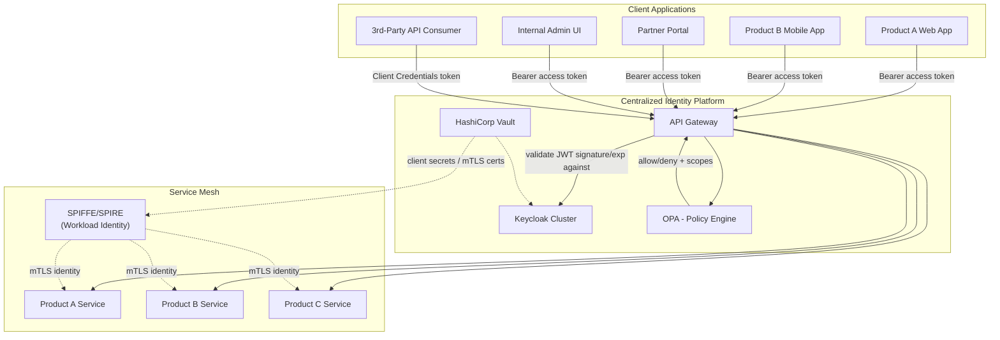

The gateway is the enforcement boundary, not the frontend — a compromised or outdated client build can't bypass authorization because it never had the authority to grant itself access, only to carry a token the IdP issued and the gateway independently re-validates.

### 4c. Alternative Enforcement Pattern: Nginx + Auth Proxy

The API Gateway + OPA pattern above is the right fit for API traffic across many products that need centralized, fine-grained policy. But not every app in the portfolio needs that much machinery — a simple internal tool, a legacy web app mid-migration (see §5), or a product that's mostly server-rendered HTML rather than an API consumer, is often better served by a lighter-weight pattern: an authenticating reverse proxy in front of the app itself.

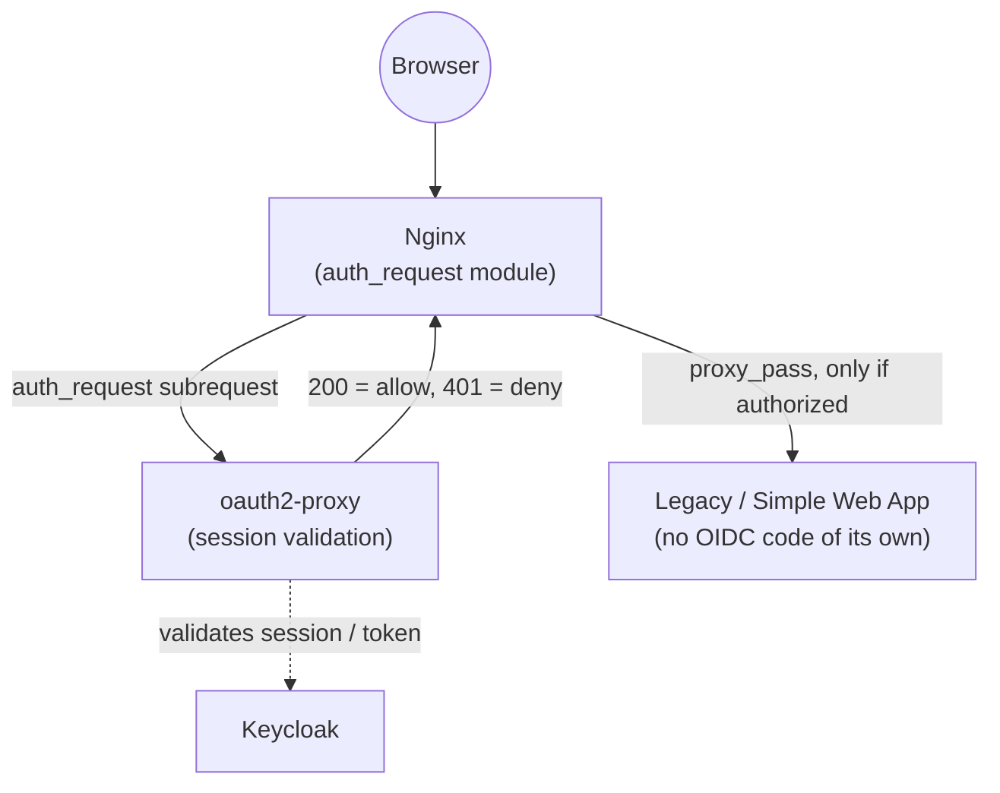

**How this differs from the Gateway pattern:** `oauth2-proxy` (or an equivalent auth sidecar) sits beside Nginx and handles the entire OIDC dance on the app's behalf — the app itself never sees a token or writes any auth code, it just trusts that Nginx wouldn't have proxied the request through if `auth_request` hadn't returned 200. This is the right tool when you want to **retrofit** identity-platform coverage onto an app you don't want to (or can't easily) modify — which is exactly the situation for several products during the migration window described in §5. It's not a replacement for the API Gateway pattern for genuine API traffic; it's a lower-effort on-ramp for apps that are mostly UI, not API surface.

**Key properties of the target state:**
- **One identity, every product.** A customer, employee, or partner authenticates once against the central IdP and gets scoped access across whichever products their role/tenant grants.
- **The API Gateway is the enforcement point**, not each product individually — it validates tokens and consults the policy engine before any request reaches a backend service.
- **Machine identity is a first-class citizen**, not an afterthought: services identify themselves to each other via SPIFFE/SPIRE-issued workload identity over mTLS, independent of any human-facing login.
- **Secrets never live in application config** — Vault issues and rotates client secrets, database credentials, and mTLS certificates.

## 5. Transitional / Intermediate Architecture

Nobody replaces four products' worth of auth in one release. The realistic path is a **broker/federation pattern**: the new central IdP sits in front of existing per-product logins as an identity broker, so products can be migrated one at a time behind a stable façade.

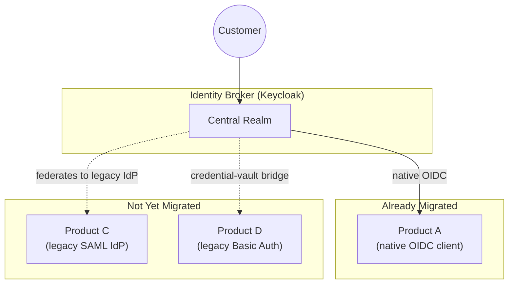

**Migration sequencing approach:**
1. Stand up the central IdP as a broker with **zero disruption** to existing logins — it federates to each product's existing auth for products not yet migrated.
2. Migrate products in order of **highest shared-customer overlap first** — this is where duplicate-login pain (and the business case for the platform) is most visible.
3. For legacy SAML products, the broker acts as a SAML Service Provider *to* the legacy IdP during transition, and becomes the actual IdP once the product is migrated to native OIDC.
4. For legacy Basic Auth / API-key products, introduce a credential-vault bridge (Vault-issued, rotated credentials matching the legacy scheme) as a stop-gap while the product team implements OIDC support.
5. Retire each legacy federation link as its product completes migration — the broker becomes the sole IdP once the last product cuts over.

### 5a. User Migration Strategy

Standing up the broker solves *system* migration. It doesn't move a single actual user identity. That's a separate problem with its own risks — mainly, you cannot recover a plaintext password from a legacy hash, so the migration approach has to be chosen per legacy source without ever forcing a mass password reset if it's avoidable (a mass reset is itself a phishing/support-load risk, not just a UX inconvenience).

| Legacy source | Approach | Why |
|---|---|---|
| **LDAP / Active Directory** | Keycloak's native **User Federation** provider — reads (and optionally writes) directly against the existing directory. No user migration event at all; Keycloak becomes a façade in front of LDAP from day one. | Zero migration risk. LDAP stays the source of truth until (if ever) you choose to import and decommission it later, on its own timeline. |
| **Per-product database with password hashes (bcrypt/scrypt/PBKDF2/etc.)** | **Lazy migration on login**: import the user record (email, profile attributes, group/role claims) with the *legacy* hash and algorithm tagged against it. On first login, Keycloak (via a custom credential provider) verifies against the legacy algorithm, and only on success re-hashes the password under Keycloak's own scheme and discards the legacy hash. | Never asks users to reset a password; the migration is invisible to them and completes gradually as people actually log in. Accounts that never log in again simply never get re-hashed — a known, accepted trade-off, not a gap to hide. |
| **Email-only / magic-link / social-login products (no real password ever existed)** | Pre-provision the Keycloak user with the verified email and no credential set; route first login through Keycloak's own email-OTP or magic-link authenticator (or federate straight to the same social IdP the product used, e.g. Google) rather than inventing a password requirement that never existed for that product. | Matches the actual security posture the user already agreed to; introducing a password here would be a regression, not an upgrade. |

**Identity deduplication and reconciliation:** the same person is frequently a "customer" in Product A's database and a separately-created "customer" in Product B's database, with no shared key beyond, usually, an email address that may or may not match exactly (case, aliasing, typos). This is not a hypothetical problem for me — it's structurally the same problem I solved with a golden-source identity platform at a previous employer: a central repository as the authoritative identity source, with a dedicated event pipeline handling unique-ID generation, deduplication, and merge/split events as records from different systems get reconciled into one identity. The same pattern applies here: a migration reconciliation pass (batch or event-driven) that matches candidate records across legacy stores, flags high-confidence auto-merges vs. low-confidence records that need manual review, and emits one canonical Keycloak user per resolved identity rather than one per legacy source.

**Rollback and safety:**
- Keep the legacy user store **read-only but intact** for a defined window after cutover (not deleted) — if a migrated credential path has an edge case, the legacy system is still the ground truth to reconcile against.
- Migrate in **cohorts** (e.g., by product, by tenant, or by a low-risk internal-users-first wave) rather than a big-bang cutover, mirroring the product-migration sequencing above.
- Communicate MFA re-enrollment clearly and in advance — MFA state (registered authenticator apps, phone numbers) generally cannot be migrated automatically and is the most common source of user-facing friction in an IdP consolidation.

---

## 6. Organization → Tenant Model

Two levels of grouping, not one. An **Organization** is the customer entity that signed a contract — a company. A **Tenant** is an isolated slice of the platform that org's users actually operate in. Most orgs have exactly one tenant; larger enterprise customers may run several (e.g., separate tenants per business unit, region, or environment).

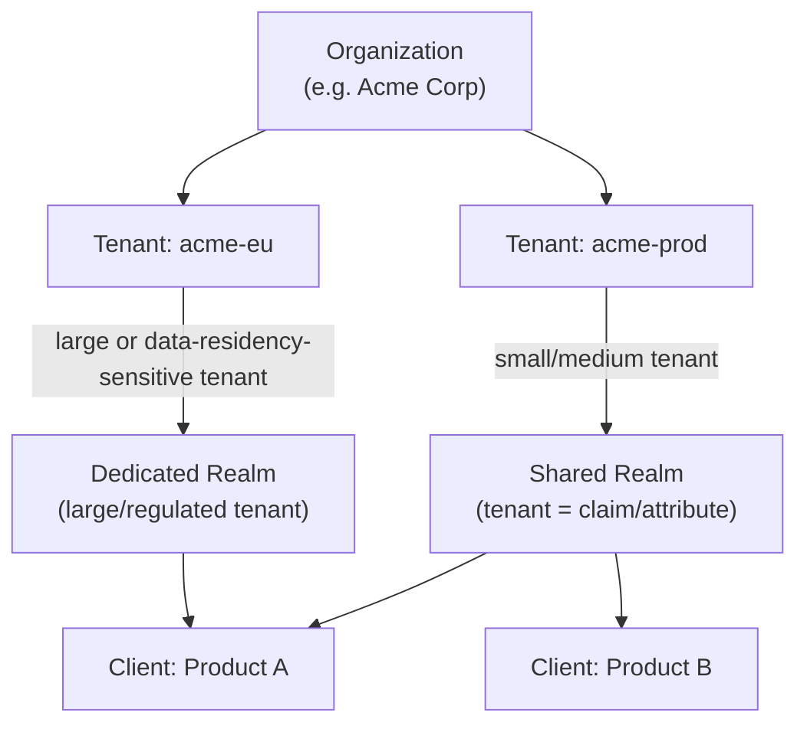

**Two supported patterns, chosen per-tenant rather than globally:**

| Pattern | When to use | Trade-off |
|---|---|---|
| **Shared realm, tenant as a claim/attribute** | The default for the vast majority of tenants | Lower operational overhead (one realm to run), but tenant isolation is enforced in application/policy logic, not by the IdP boundary itself — a bug in that logic is a cross-tenant leak |
| **Dedicated realm per tenant** | Large enterprise customers, or tenants with contractual/regulatory data-residency requirements | Strong isolation at the IdP level (separate user pools, separate signing keys, independently revocable), at the cost of more realms to operate and provision per new customer |

**Delegated administration boundary:** an "Org Admin" role is scoped so it can only manage users, groups, and role assignments *within its own organization's tenant(s)* — never across organizations. This is enforced two ways depending on the pattern above: dedicated realms get this for free (an org admin in Keycloak is scoped to their own realm), while the shared-realm pattern needs an explicit policy layer (§10) checking the tenant claim on every admin action, since Keycloak's own admin console doesn't natively scope by an arbitrary attribute.

## 7. Identity Classes & RBAC Design

Not every identity in this system is the same shape. Distinguishing the three human identity classes up front — before writing a single role — avoids the common mistake of one flat role list that mixes "can view invoices" (customer-facing) with "can restart a production pod" (employee-facing).

| Identity class | Client(s) they use | Example roles | Notes |
|---|---|---|---|
| **Customer** | Per-product web/mobile apps | `owner`, `member`, `viewer` (scoped to their own org/tenant) | Roles are almost always tenant-scoped — a customer role never grants cross-tenant access |
| **Employee** | Internal admin UI, internal tooling | `support-agent`, `platform-engineer`, `org-admin`, `superadmin` | Roles can be cross-tenant by design (support needs to look across customers) — this is exactly where over-broad grants become the "toxic combination" risk flagged in §2 |
| **Partner** | Partner portal, partner API integrations | `partner-viewer`, `partner-admin` | Scoped not just to a tenant but often to a *subset* of that tenant's data (delegated, not full, access) — closer to ABAC than pure RBAC (see below) |

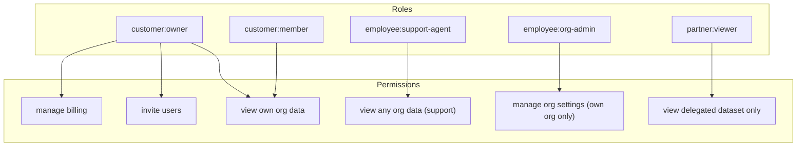

**RBAC alone isn't enough for the Partner class or for fine-grained delegated access** — "this partner can see this one dataset within this one tenant" isn't expressible as a static role without an explosion of roles-per-partner. That's an attribute-based (ABAC) decision, made by the policy engine at request time rather than baked into a role name — covered in §10.

This mirrors application-security and identity pattern work I've done previously across banking and fintech clients: defining IAM, OAuth2/OIDC, and API-gateway identity patterns, including PSD2/Open Banking-style delegated and scoped access models where a third party gets a deliberately narrow slice of a customer's data, not blanket access.

## 8. SSO Design: Keycloak Clustering

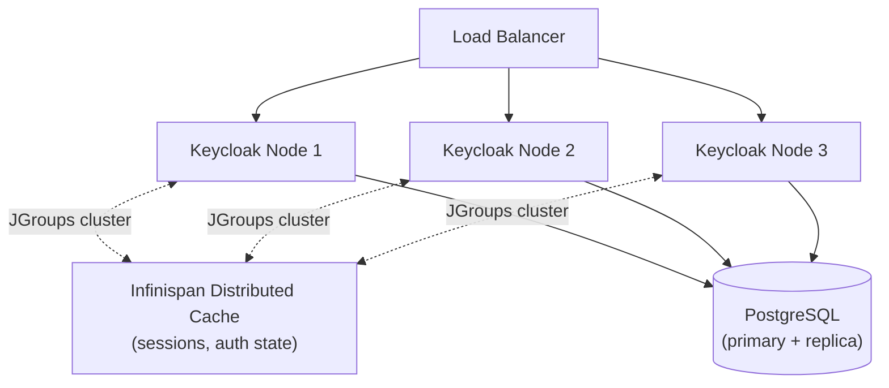

- Keycloak nodes are **stateless behind the load balancer** — session and authentication state lives in the distributed Infinispan cache shared across nodes (via JGroups), not pinned to one node. A node can be drained or lost without terminating in-flight logins.
- The load balancer needs a health-check against Keycloak's own readiness endpoint, not just a TCP check — a node that's up but has lost cluster membership should be pulled from rotation.
- PostgreSQL holds durable state (realm config, persistent user data, offline tokens); the cache holds ephemeral session state. Losing the cache loses active sessions (forces re-login), losing the DB is a real incident.

**Illustrative capacity benchmark** *(estimated for planning discussion purposes — not measured production data)*:

| Metric | Illustrative estimate |
|---|---|
| Login throughput per node (Auth Code + PKCE, warm cache) | ~150-300 logins/sec |
| Token validation (JWKS-cached, local signature check) | ~2,000+ req/sec per gateway node — doesn't hit Keycloak at all once JWKS is cached |
| Token introspection (live call to Keycloak, needed only where immediate revocation matters) | ~500-800 req/sec per Keycloak node |
| Cluster failover (single node loss, session continuity) | Seconds, not minutes, given healthy cache replication |

The gap between "token validation" and "token introspection" throughput above is the whole reason §9's gateway pattern prefers local JWT signature validation for routine calls and reserves live introspection for cases where immediate revocation matters (e.g., a just-disabled account) — this is a deliberate design lever, not an oversight.

This clustering approach draws on prior work architecting a dual authentication model for a point-of-sale platform — supporting legacy signature-based auth alongside a new Okta SSO integration (OAuth2 Authorization Code + PKCE) — where availability of the SSO layer itself was a hard production requirement, not optional.

## 9. API Gateway + Keycloak as Identity Provider

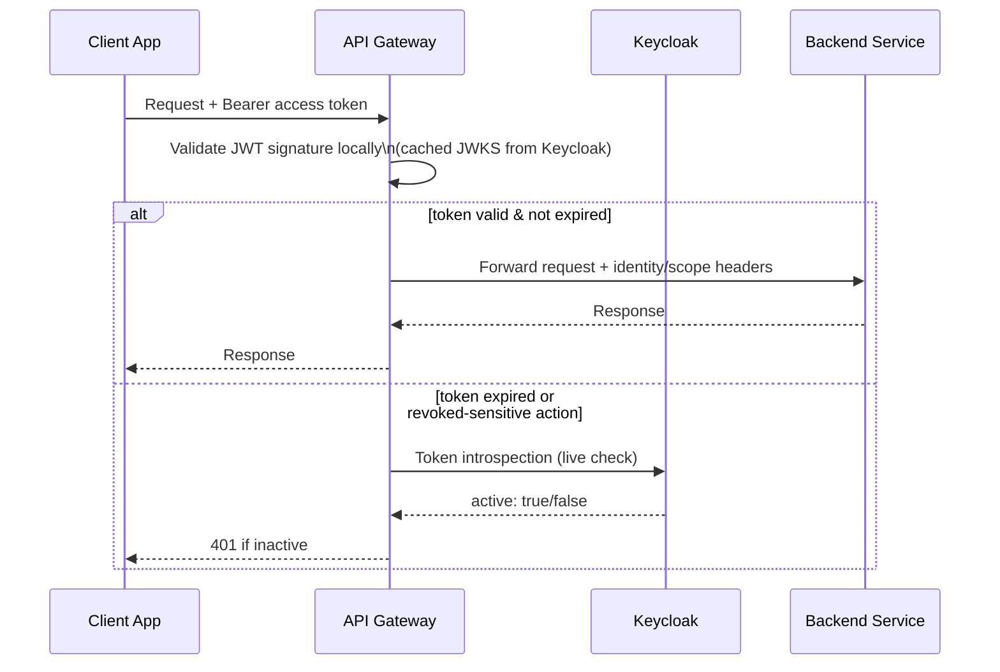

**Two validation modes, used deliberately, not interchangeably:**
- **Local JWT validation (default):** the gateway caches Keycloak's JWKS (public signing keys) and verifies the token's signature and expiry itself, with no network call to Keycloak per request. Fast, scales horizontally with the gateway, but can't see a revocation that happened *after* the token was issued until it naturally expires.
- **Token introspection (exception path):** a live call to Keycloak's introspection endpoint, used only where immediate revocation matters — e.g., right after an admin disables an account, or for a short-lived, high-sensitivity operation. Reserved for the exception path specifically because of the throughput gap shown in §8's benchmark table.

The gateway also injects identity/scope information (subject, roles, tenant claim) into internal headers for the backend service to consume — the backend trusts the gateway's header, not the raw client-presented token, because only the gateway sits on the trust boundary between the outside world and the internal mesh (§14 covers how that internal boundary itself is separately secured via mTLS/SPIFFE, so a compromised backend can't simply forge those headers by calling another internal service directly).

## 10. Delegated Administration: GitOps + OPA

Role assignments (§7) answer "what can this identity class generally do." They don't answer finer questions like "can this specific partner see this specific dataset in this specific tenant" — that's a runtime, attribute-based decision, and it needs a review/approval trail, since it's effectively a security-policy change.

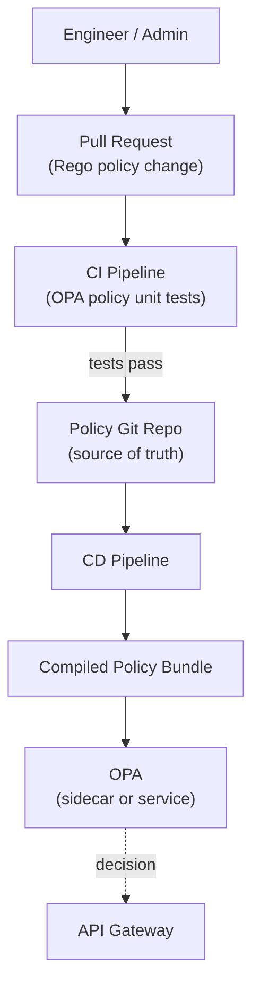

**Why GitOps for policy specifically:** a policy change (e.g., "grant Partner X read access to Tenant Y's reporting data") is a security-relevant change with the same review discipline as a code change — a PR, a reviewer, a test suite, and a git history that answers "who approved this access and when" without needing a separate audit system bolted on afterward. That audit trail is itself a piece of the governance/compliance story in §16.

**Illustrative policy shape** (conceptual, not a literal production policy):

```rego
package authz.partner_access

default allow = false

allow {
    input.identity.type == "partner"
    input.identity.partner_id == data.delegations[input.resource.tenant_id][input.resource.dataset_id]
    input.action == "read"
}
```

The API Gateway (§9) calls OPA as part of its enforcement step — not instead of the coarser RBAC role check, but layered after it, for the fine-grained/delegated cases RBAC alone can't express.

## 11. MFA Approach

| Factor | Where it fits | Notes |
|---|---|---|
| **TOTP (authenticator app)** | Baseline for all identity classes | Widely supported, no SMS carrier dependency |
| **Push notification** | Better UX for employees/frequent users | Requires an app; vulnerable to prompt-bombing without additional number-matching controls |
| **WebAuthn / FIDO2 (security key or platform authenticator)** | Required for employees/admins with elevated access | Phishing-resistant by construction — the credential is bound to the origin, so it simply doesn't work on a lookalike domain |
| **SMS OTP** | Fallback only, not primary | Known SIM-swap/interception weaknesses; kept only for account-recovery paths where nothing else is available |

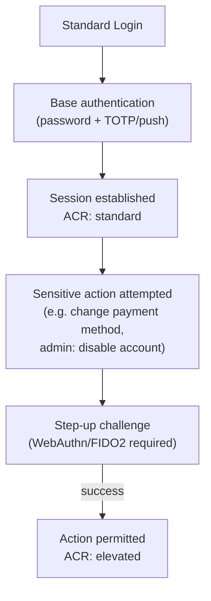

**Step-up authentication, not uniform friction:** the base login uses whatever factor the user has enrolled; specific high-risk actions demand re-authentication with a stronger factor (encoded in the token's `acr`/`amr` claims, which the policy engine in §10 can check). This avoids the two failure modes of MFA design: too little friction everywhere (weak), or too much friction everywhere (users route around it).

## 12. Protocol Selection Guidance: SAML vs. OAuth2/OIDC

| Application type | Recommended flow | Why |
|---|---|---|
| Modern server-rendered web app | OIDC Authorization Code + PKCE | Standard, well-supported, no implicit-flow token-in-URL exposure |
| Single-page app (SPA) | OIDC Authorization Code + PKCE (never Implicit) | PKCE removes the need for a client secret in a public client; Implicit flow is deprecated for good reason (tokens exposed in browser history/referrers) |
| Native mobile app | OIDC Authorization Code + PKCE, app-claimed HTTPS redirect (not a custom URI scheme) | App-claimed HTTPS redirects can't be hijacked by another app registering the same custom scheme |
| Machine-to-machine service | OAuth2 Client Credentials | No user in the loop; the service authenticates as itself |
| Legacy enterprise app that only speaks SAML | SAML 2.0, SP-initiated, with Keycloak as the SAML IdP | Don't force a legacy vendor app to be rewritten just to join the platform — broker it |
| Partner with their own existing IdP | OIDC or SAML federation (Keycloak as broker to the partner's IdP) | The partner's users authenticate against their own IdP; Keycloak trusts that assertion rather than creating duplicate partner-side accounts |

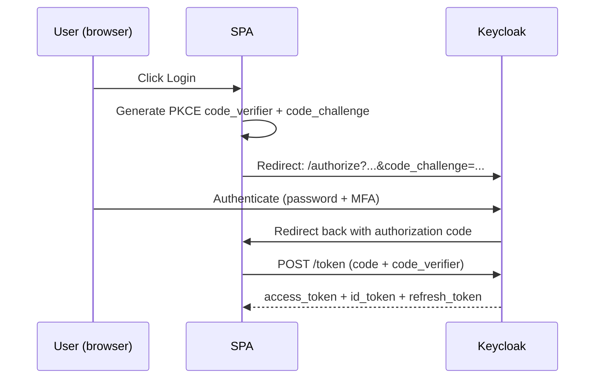

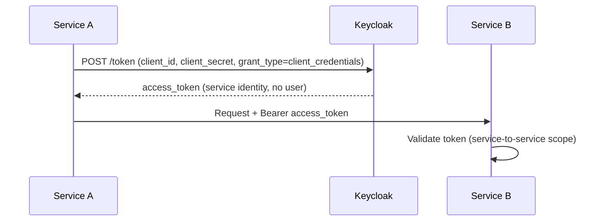

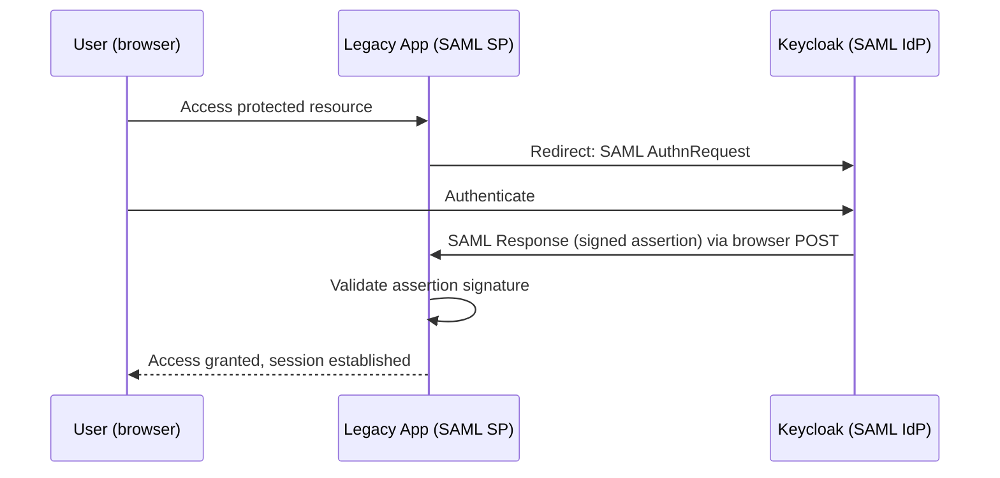

## 13. Vendor-Agnostic Note: Open-Source vs. Proprietary IdP

Every diagram in this document uses Keycloak as the concrete implementation because it's open-source, self-hostable, and lets the diagrams be specific rather than hand-wavy. The architecture itself — central IdP, API Gateway enforcement, policy engine, broker-based migration — does not depend on Keycloak specifically.

| Consideration | Keycloak (open-source) | Proprietary (Okta / Auth0 / Ping / Entra ID) |
|---|---|---|
| Cost model | Infrastructure + operational cost, no per-user license fee | Per-user/per-MAU licensing, often significant at scale |
| Operational burden | You run and patch it (or a managed Keycloak offering) | Vendor-managed uptime/patching |
| Enterprise IdP integrations out of the box | Supported via standard protocols, sometimes more setup | Often more polished pre-built connectors (e.g., Entra ID ↔ Entra ID scenarios) |
| Compliance certifications inherited | You inherit only what your own hosting environment provides | Vendor typically brings its own SOC 2/ISO 27001 attestation, which can simplify your own audit story |
| Customization depth | Full control over authentication flows (SPIs) | Usually more constrained to vendor-supported extension points |

I have direct production experience on both sides of this table: architecting a dual authentication model against **Okta** as the SSO provider for a regulated financial-services point-of-sale platform, and separately building a demo integrating **Keycloak** with a FAPI (Financial-grade API) profile — [`fapi2`](https://github.com/guymoyo/fapi2) — to explore high-security OAuth2/OIDC flows for banking-grade APIs. The [`spring-angular-okta`](https://github.com/guymoyo/spring-angular-okta) repo is a smaller, full-stack demo of the Okta/OIDC integration pattern specifically. Neither repo is a Kaseya-specific artifact — they're general demonstrations of the same protocol depth this document argues for.

## 14. Machine Identity & Service-to-Service Security

Human identity (§4a) and machine identity are different trust models and shouldn't be forced through the same mechanism. A service doesn't have a password to forget or an MFA app to install — it needs a way to prove *which workload it is* that's rotated automatically and never touched by a human.

```mermaid
graph TD
    subgraph Mesh["Service Mesh"]
        SPIRE_Server["SPIRE Server"]
        SPIRE_Agent_A["SPIRE Agent\n(Node A)"]
        SPIRE_Agent_B["SPIRE Agent\n(Node B)"]
        SvcA["Service A"]
        SvcB["Service B"]
    end

    Vault["HashiCorp Vault"]

    SPIRE_Server -->|attests node identity| SPIRE_Agent_A
    SPIRE_Server -->|attests node identity| SPIRE_Agent_B
    SPIRE_Agent_A -->|issues SVID\n(short-lived X.509)| SvcA
    SPIRE_Agent_B -->|issues SVID\n(short-lived X.509)| SvcB
    SvcA <-->|mTLS, mutual SVID validation| SvcB
    Vault -.dynamic secrets, cert authority.-> SPIRE_Server
    Vault -.client secrets for OAuth2 client-credentials flows.-> SvcA
```

- **SPIFFE/SPIRE** gives every workload a cryptographically verifiable identity (an SVID — short-lived X.509 cert or JWT) tied to *what it is* (its attested identity: which node, which workload, which namespace), not a long-lived shared secret. SVIDs rotate automatically and short-lived, so a leaked one has a small blast-radius window.
- **mTLS across the mesh** means every service-to-service call is mutually authenticated — Service A proves its identity to Service B and vice versa — independent of and in addition to any OAuth2 token that might also be carried for authorization purposes.
- **Vault** is the root of trust for anything that still needs a traditional secret: OAuth2 client-credentials secrets for services not yet in the mesh, database credentials (ideally as short-lived dynamic secrets, not static passwords), and the certificate authority material SPIRE itself depends on. Nothing in the target architecture stores a long-lived secret in application config or an environment variable.
- Where a service can't yet participate in the mesh (e.g., a legacy product mid-migration per §5), it falls back to OAuth2 Client Credentials against Keycloak directly, with the secret sourced from Vault rather than hardcoded — a deliberately lower bar than full SPIFFE/mTLS, chosen because it's achievable without first re-platforming the legacy service.

This mirrors the same high-security-API mindset behind the [`fapi2`](https://github.com/guymoyo/fapi2) demo — FAPI profiles exist specifically because "just use OAuth2" isn't sufficient for banking-grade API security without additional constraints (sender-constrained tokens, strict client authentication), and that same instinct — don't trust a bearer token alone when the stakes are high — is what motivates mTLS/SPIFFE for service-to-service traffic here rather than bearer tokens alone.

---
