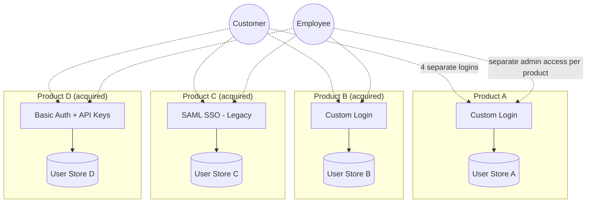
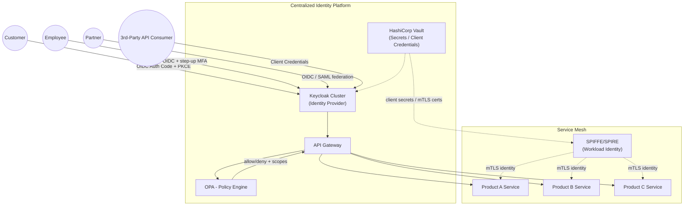
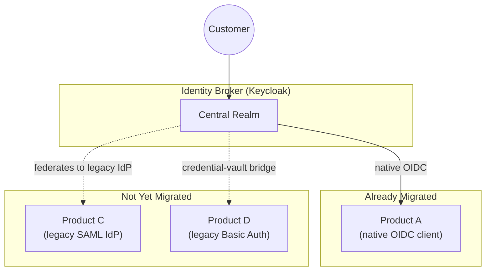

# Centralized IAM Platform: A Reference Architecture for Multi-Product SaaS

> **Scope note:** This is a vendor-agnostic reference architecture I built to think through how I'd design a centralized identity platform for an organization that has grown through acquisition — where each product line historically ran its own authentication stack with no shared identity foundation. It draws on 15+ years of distributed-systems and identity/access-management work in regulated financial services, but **it is not based on any specific employer's actual systems, internal architecture, or confidential information.** Diagrams and any benchmark figures are illustrative, not measured production data — labeled as such throughout.

---

## Table of Contents

1. [Executive Summary](#1-executive-summary)
2. [Current State (As-Is): Fragmented Per-Product Identity](#2-current-state-as-is-fragmented-per-product-identity)
3. [Requirements Traceability](#3-requirements-traceability)
4. [Target Architecture: Centralized IAM Platform](#4-target-architecture-centralized-iam-platform)
5. [Transitional / Intermediate Architecture](#5-transitional--intermediate-architecture)
6. Organization → Tenant Model *(coming next)*
7. Identity Classes & RBAC Design *(coming next)*
8. SSO Design: Keycloak Clustering *(coming next)*
9. API Gateway + Keycloak as Identity Provider *(coming next)*
10. Delegated Administration: GitOps + OPA *(coming next)*
11. MFA Approach *(coming next)*
12. Protocol Selection Guidance: SAML vs. OAuth2/OIDC *(coming next)*
13. Vendor-Agnostic Note: Open-Source vs. Proprietary IdP *(coming next)*
14. Machine Identity & Service-to-Service Security *(coming next)*
15. Standards & References *(coming next)*
16. Extensions Considered *(coming next)*
17. About This Document *(coming next)*

---

## 1. Executive Summary

Organizations that grow through acquisition often end up with a product portfolio where each acquired product brought its own user store, its own login flow, and its own notion of "who is a user." The result: customers juggle multiple logins across a supposedly unified suite, engineering teams re-implement the same authentication logic per product, and no one can answer basic governance questions ("who has access to what, across the whole portfolio?") without a manual audit.

This document is a reference architecture for solving that problem: a **centralized Identity and Access Management (IAM) platform** that becomes the single authentication, authorization, and governance foundation across every product in the portfolio — while still supporting the full range of identity types a modern SaaS platform actually has to serve:

- **Customers** — end users of the products
- **Employees** — internal staff needing access to internal tooling and admin surfaces
- **Partners** — external organizations with delegated, scoped access to specific products or data
- **APIs** — first- and third-party API consumers
- **Machine identities** — services, jobs, and workloads authenticating to each other, not to a human

The architecture is deliberately **vendor-agnostic**: the concrete diagrams in this document use **Keycloak** as the open-source reference implementation, but the same design applies equally to a proprietary identity provider such as **Okta**, **Auth0**, **Ping Identity**, or **Microsoft Entra ID** — the IdP is a replaceable component behind a stable set of interfaces (OIDC/OAuth2/SAML), not the architecture itself.

**How to read this document:** Section 2 shows the fragmented starting point most acquisition-heavy portfolios share. Section 3 is a traceability table if you want to jump straight to a specific capability. Sections 4-5 lay out the target state and the transitional path to get there. Sections 6-14 go deep on each major capability (multi-tenancy, RBAC, SSO, API security, delegated admin, MFA, protocol choice, machine identity). Section 16 is deliberately explicit about what a production rollout would still need beyond what's diagrammed here — I'd rather show you where I drew the line than pretend the diagrams are the whole system.

## 2. Current State (As-Is): Fragmented Per-Product Identity

**Consequences of this state:**
- A customer using three products in the suite has three separate accounts, three passwords, three MFA enrollments.
- There is no single place to answer "does this partner still have access to anything?" — it requires checking every product individually.
- Every new product acquisition adds another bespoke auth integration instead of plugging into a shared foundation.
- Security incident response (e.g., "revoke this user's access everywhere, now") is a manual, per-product fire drill instead of one action.
- Compliance evidence (SOC 2, ISO 27001, access reviews) has to be assembled per product rather than generated once from a central system.

## 3. Requirements Traceability

A quick map from capability asked-for to where it's addressed in this document.

| Capability | Section |
|---|---|
| Centralized identity foundation across multiple products/business domains | §4, §5 |
| Authentication, authorization, identity governance | §4, §7, §10 |
| Serves customers, employees, partners, APIs, machine identities | §4, §6, §7 |
| Platform architecture & technical direction | §4, §5 |
| Drive adoption / migration across engineering teams | §5, §16 |
| RBAC, ABAC, delegated administration | §7, §10 |
| Multi-tenant environments | §6 |
| Governance & regulatory/compliance requirements | §16 |
| Architecture reviews / technical design discussions | Document itself, plus §3 traceability |
| OAuth 2.0, OIDC, SAML, JWTs, MFA, enterprise SSO | §8, §9, §11, §12 |
| Enterprise IAM platform integration (Keycloak, Okta, Auth0, Ping, Zitadel, Authentik) | §8, §13 |
| Secure, scalable services in cloud-based/SaaS environments | §4, §9, §14 |
| Policy engines (OPA / Cedar) | §10 |
| Machine identities, secrets management, workload authentication | §14 |
| Large-scale platform migrations / modernization | §5, §16 |
| SOC 2, ISO 27001, HIPAA, PCI-DSS, NIST | §16 |

## 4. Target Architecture: Centralized IAM Platform

**Key properties of the target state:**
- **One identity, every product.** A customer, employee, or partner authenticates once against the central IdP and gets scoped access across whichever products their role/tenant grants.
- **The API Gateway is the enforcement point**, not each product individually — it validates tokens and consults the policy engine before any request reaches a backend service.
- **Machine identity is a first-class citizen**, not an afterthought: services identify themselves to each other via SPIFFE/SPIRE-issued workload identity over mTLS, independent of any human-facing login.
- **Secrets never live in application config** — Vault issues and rotates client secrets, database credentials, and mTLS certificates.

## 5. Transitional / Intermediate Architecture

Nobody replaces four products' worth of auth in one release. The realistic path is a **broker/federation pattern**: the new central IdP sits in front of existing per-product logins as an identity broker, so products can be migrated one at a time behind a stable façade.

**Migration sequencing approach:**
1. Stand up the central IdP as a broker with **zero disruption** to existing logins — it federates to each product's existing auth for products not yet migrated.
2. Migrate products in order of **highest shared-customer overlap first** — this is where duplicate-login pain (and the business case for the platform) is most visible.
3. For legacy SAML products, the broker acts as a SAML Service Provider *to* the legacy IdP during transition, and becomes the actual IdP once the product is migrated to native OIDC.
4. For legacy Basic Auth / API-key products, introduce a credential-vault bridge (Vault-issued, rotated credentials matching the legacy scheme) as a stop-gap while the product team implements OIDC support.
5. Retire each legacy federation link as its product completes migration — the broker becomes the sole IdP once the last product cuts over.

---

*Sections 6-17 (multi-tenancy, RBAC, SSO clustering, API Gateway integration, delegated administration via GitOps+OPA, MFA, protocol selection, vendor-agnostic notes, machine identity, standards references, and an explicit list of what's out of scope here) are drafted next — this skeleton is the checkpoint before going further.*
