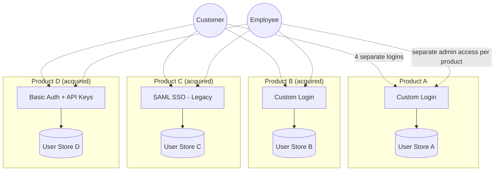
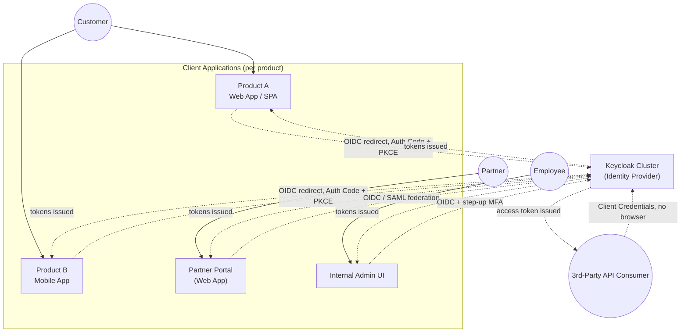
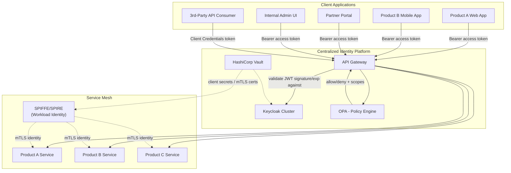
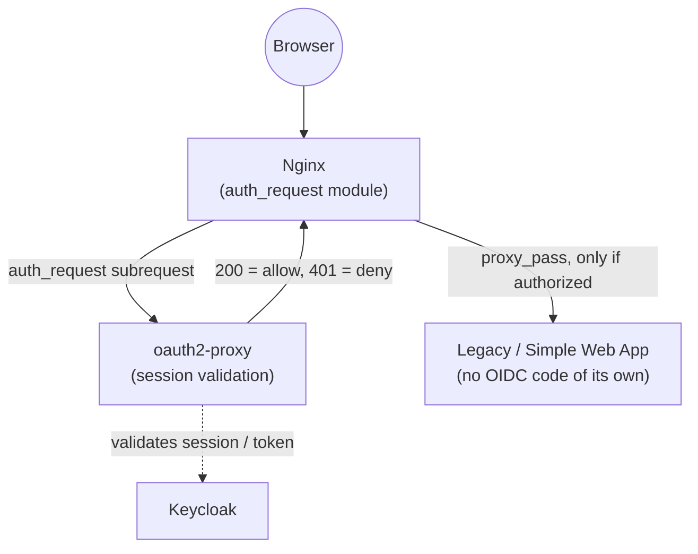
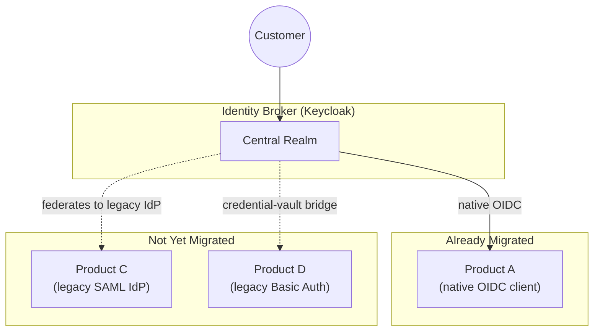

# Centralized IAM Platform: A Reference Architecture for Multi-Product SaaS

> **Scope note:** This is a vendor-agnostic reference architecture I built to think through how I'd design a centralized identity platform for an organization that has grown through acquisition — where each product line historically ran its own authentication stack with no shared identity foundation. It draws on 15+ years of distributed-systems and identity/access-management work in regulated financial services, but **it is not based on any specific employer's actual systems, internal architecture, or confidential information.** Diagrams and any benchmark figures are illustrative, not measured production data — labeled as such throughout.

---

## Table of Contents

1. [Executive Summary](#1-executive-summary)
2. [Current State (As-Is): Fragmented Per-Product Identity](#2-current-state-as-is-fragmented-per-product-identity)
3. [Requirements Traceability](#3-requirements-traceability)
4. [Target Architecture: Centralized IAM Platform](#4-target-architecture-centralized-iam-platform)
   - [4a. Authentication Flow](#4a-authentication-flow--establishing-identity)
   - [4b. Authorization & Service Enforcement Flow](#4b-authorization--service-enforcement-flow--what-an-authenticated-identity-can-actually-do)
   - [4c. Alternative Enforcement Pattern: Nginx + Auth Proxy](#4c-alternative-enforcement-pattern-nginx--auth-proxy)
5. [Transitional / Intermediate Architecture](#5-transitional--intermediate-architecture)
   - [5a. User Migration Strategy](#5a-user-migration-strategy)
6. Organization → Tenant Model *(coming next)*
7. Identity Classes & RBAC Design *(coming next)*
8. SSO Design: Keycloak Clustering *(coming next)*
9. API Gateway + Keycloak as Identity Provider *(coming next)*
10. Delegated Administration: GitOps + OPA *(coming next)*
11. MFA Approach *(coming next)*
12. Protocol Selection Guidance: SAML vs. OAuth2/OIDC *(coming next)*
13. Vendor-Agnostic Note: Open-Source vs. Proprietary IdP *(coming next)*
14. Machine Identity & Service-to-Service Security *(coming next)*
15. Standards & References *(coming next)*
16. Extensions Considered *(coming next)*
17. About This Document *(coming next)*

---

## 1. Executive Summary

Organizations that grow through acquisition often end up with a product portfolio where each acquired product brought its own user store, its own login flow, and its own notion of "who is a user." The result: customers juggle multiple logins across a supposedly unified suite, engineering teams re-implement the same authentication logic per product, and no one can answer basic governance questions ("who has access to what, across the whole portfolio?") without a manual audit.

This document is a reference architecture for solving that problem: a **centralized Identity and Access Management (IAM) platform** that becomes the single authentication, authorization, and governance foundation across every product in the portfolio — while still supporting the full range of identity types a modern SaaS platform actually has to serve:

- **Customers** — end users of the products
- **Employees** — internal staff needing access to internal tooling and admin surfaces
- **Partners** — external organizations with delegated, scoped access to specific products or data
- **APIs** — first- and third-party API consumers
- **Machine identities** — services, jobs, and workloads authenticating to each other, not to a human

The architecture is deliberately **vendor-agnostic**: the concrete diagrams in this document use **Keycloak** as the open-source reference implementation, but the same design applies equally to a proprietary identity provider such as **Okta**, **Auth0**, **Ping Identity**, or **Microsoft Entra ID** — the IdP is a replaceable component behind a stable set of interfaces (OIDC/OAuth2/SAML), not the architecture itself.

**How to read this document:** Section 2 shows the fragmented starting point most acquisition-heavy portfolios share. Section 3 is a traceability table if you want to jump straight to a specific capability. Sections 4-5 lay out the target state and the transitional path to get there. Sections 6-14 go deep on each major capability (multi-tenancy, RBAC, SSO, API security, delegated admin, MFA, protocol choice, machine identity). Section 16 is deliberately explicit about what a production rollout would still need beyond what's diagrammed here.

## 2. Current State (As-Is): Fragmented Per-Product Identity

**Consequences of this state:**
- A customer using three products in the suite has three separate accounts, three passwords, three MFA enrollments.
- There is no single place to answer "does this partner still have access to anything?" — it requires checking every product individually.
- Every new product acquisition adds another bespoke auth integration instead of plugging into a shared foundation.
- Security incident response (e.g., "revoke this user's access everywhere, now") is a manual, per-product fire drill instead of one action.
- Compliance evidence (SOC 2, ISO 27001, access reviews) has to be assembled per product rather than generated once from a central system.
- Without a unified view of who holds what access across the whole portfolio, **toxic combinations of access rights** (e.g., a user who can both administer a product and approve changes to it in another — a segregation-of-duties violation) are effectively invisible until an audit or an incident surfaces them.

## 3. Requirements Traceability

A quick map from capability asked-for to where it's addressed in this document.

| Capability | Section |
|---|---|
| Centralized identity foundation across multiple products/business domains | §4, §5 |
| Authentication, authorization, identity governance | §4, §7, §10 |
| Serves customers, employees, partners, APIs, machine identities | §4, §6, §7 |
| Platform architecture & technical direction | §4, §5 |
| Drive adoption / migration across engineering teams | §5, §5a, §16 |
| RBAC, ABAC, delegated administration | §7, §10 |
| Multi-tenant environments | §6 |
| Governance & regulatory/compliance requirements | §16 |
| Architecture reviews / technical design discussions | Document itself, plus §3 traceability |
| OAuth 2.0, OIDC, SAML, JWTs, MFA, enterprise SSO | §8, §9, §11, §12 |
| Enterprise IAM platform integration (Keycloak, Okta, Auth0, Ping, Zitadel, Authentik) | §8, §13 |
| Secure, scalable services in cloud-based/SaaS environments | §4, §9, §14 |
| Policy engines (OPA / Cedar) | §10 |
| Machine identities, secrets management, workload authentication | §14 |
| Large-scale platform migrations / modernization | §5, §16 |
| SOC 2, ISO 27001, HIPAA, PCI-DSS, NIST | §16 |

## 4. Target Architecture: Centralized IAM Platform

Split into two diagrams on purpose: authentication (establishing who someone is) and authorization/enforcement (what they can do once they're in) are different concerns with different failure modes, and conflating them in one diagram made the picture harder to read than it needed to be.

### 4a. Authentication Flow — establishing identity

**Where the frontend sits, explicitly:** each product's client application (web SPA, mobile app, partner portal, internal admin UI) is itself an OIDC client. It never talks to the identity provider on the user's behalf silently — the user is redirected to the IdP to authenticate (Authorization Code + PKCE for browser/mobile clients, so the client never handles raw credentials), gets redirected back with an authorization code, and the client exchanges that for tokens. §9 and §12 walk through this exact sequence step by step.

### 4b. Authorization & Service Enforcement Flow — what an authenticated identity can actually do

The gateway is the enforcement boundary, not the frontend — a compromised or outdated client build can't bypass authorization because it never had the authority to grant itself access, only to carry a token the IdP issued and the gateway independently re-validates.

### 4c. Alternative Enforcement Pattern: Nginx + Auth Proxy

The API Gateway + OPA pattern above is the right fit for API traffic across many products that need centralized, fine-grained policy. But not every app in the portfolio needs that much machinery — a simple internal tool, a legacy web app mid-migration (see §5), or a product that's mostly server-rendered HTML rather than an API consumer, is often better served by a lighter-weight pattern: an authenticating reverse proxy in front of the app itself.

**How this differs from the Gateway pattern:** `oauth2-proxy` (or an equivalent auth sidecar) sits beside Nginx and handles the entire OIDC dance on the app's behalf — the app itself never sees a token or writes any auth code, it just trusts that Nginx wouldn't have proxied the request through if `auth_request` hadn't returned 200. This is the right tool when you want to **retrofit** identity-platform coverage onto an app you don't want to (or can't easily) modify — which is exactly the situation for several products during the migration window described in §5. It's not a replacement for the API Gateway pattern for genuine API traffic; it's a lower-effort on-ramp for apps that are mostly UI, not API surface.

**Key properties of the target state:**
- **One identity, every product.** A customer, employee, or partner authenticates once against the central IdP and gets scoped access across whichever products their role/tenant grants.
- **The API Gateway is the enforcement point**, not each product individually — it validates tokens and consults the policy engine before any request reaches a backend service.
- **Machine identity is a first-class citizen**, not an afterthought: services identify themselves to each other via SPIFFE/SPIRE-issued workload identity over mTLS, independent of any human-facing login.
- **Secrets never live in application config** — Vault issues and rotates client secrets, database credentials, and mTLS certificates.

## 5. Transitional / Intermediate Architecture

Nobody replaces four products' worth of auth in one release. The realistic path is a **broker/federation pattern**: the new central IdP sits in front of existing per-product logins as an identity broker, so products can be migrated one at a time behind a stable façade.

**Migration sequencing approach:**
1. Stand up the central IdP as a broker with **zero disruption** to existing logins — it federates to each product's existing auth for products not yet migrated.
2. Migrate products in order of **highest shared-customer overlap first** — this is where duplicate-login pain (and the business case for the platform) is most visible.
3. For legacy SAML products, the broker acts as a SAML Service Provider *to* the legacy IdP during transition, and becomes the actual IdP once the product is migrated to native OIDC.
4. For legacy Basic Auth / API-key products, introduce a credential-vault bridge (Vault-issued, rotated credentials matching the legacy scheme) as a stop-gap while the product team implements OIDC support.
5. Retire each legacy federation link as its product completes migration — the broker becomes the sole IdP once the last product cuts over.

### 5a. User Migration Strategy

Standing up the broker solves *system* migration. It doesn't move a single actual user identity. That's a separate problem with its own risks — mainly, you cannot recover a plaintext password from a legacy hash, so the migration approach has to be chosen per legacy source without ever forcing a mass password reset if it's avoidable (a mass reset is itself a phishing/support-load risk, not just a UX inconvenience).

| Legacy source | Approach | Why |
|---|---|---|
| **LDAP / Active Directory** | Keycloak's native **User Federation** provider — reads (and optionally writes) directly against the existing directory. No user migration event at all; Keycloak becomes a façade in front of LDAP from day one. | Zero migration risk. LDAP stays the source of truth until (if ever) you choose to import and decommission it later, on its own timeline. |
| **Per-product database with password hashes (bcrypt/scrypt/PBKDF2/etc.)** | **Lazy migration on login**: import the user record (email, profile attributes, group/role claims) with the *legacy* hash and algorithm tagged against it. On first login, Keycloak (via a custom credential provider) verifies against the legacy algorithm, and only on success re-hashes the password under Keycloak's own scheme and discards the legacy hash. | Never asks users to reset a password; the migration is invisible to them and completes gradually as people actually log in. Accounts that never log in again simply never get re-hashed — a known, accepted trade-off, not a gap to hide. |
| **Email-only / magic-link / social-login products (no real password ever existed)** | Pre-provision the Keycloak user with the verified email and no credential set; route first login through Keycloak's own email-OTP or magic-link authenticator (or federate straight to the same social IdP the product used, e.g. Google) rather than inventing a password requirement that never existed for that product. | Matches the actual security posture the user already agreed to; introducing a password here would be a regression, not an upgrade. |

**Identity deduplication and reconciliation:** the same person is frequently a "customer" in Product A's database and a separately-created "customer" in Product B's database, with no shared key beyond, usually, an email address that may or may not match exactly (case, aliasing, typos). This is not a hypothetical problem for me — it's structurally the same problem I solved with a golden-source identity platform at a previous employer: a central repository as the authoritative identity source, with a dedicated event pipeline handling unique-ID generation, deduplication, and merge/split events as records from different systems get reconciled into one identity. The same pattern applies here: a migration reconciliation pass (batch or event-driven) that matches candidate records across legacy stores, flags high-confidence auto-merges vs. low-confidence records that need manual review, and emits one canonical Keycloak user per resolved identity rather than one per legacy source.

**Rollback and safety:**
- Keep the legacy user store **read-only but intact** for a defined window after cutover (not deleted) — if a migrated credential path has an edge case, the legacy system is still the ground truth to reconcile against.
- Migrate in **cohorts** (e.g., by product, by tenant, or by a low-risk internal-users-first wave) rather than a big-bang cutover, mirroring the product-migration sequencing above.
- Communicate MFA re-enrollment clearly and in advance — MFA state (registered authenticator apps, phone numbers) generally cannot be migrated automatically and is the most common source of user-facing friction in an IdP consolidation.

---

*Sections 6-17 (multi-tenancy, RBAC, SSO clustering, API Gateway integration, delegated administration via GitOps+OPA, MFA, protocol selection, vendor-agnostic notes, machine identity, standards references, and an explicit list of what's out of scope here) are drafted next — this skeleton is the checkpoint before going further.*
